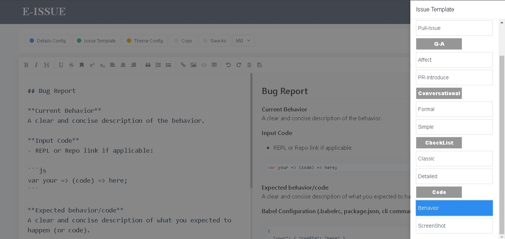
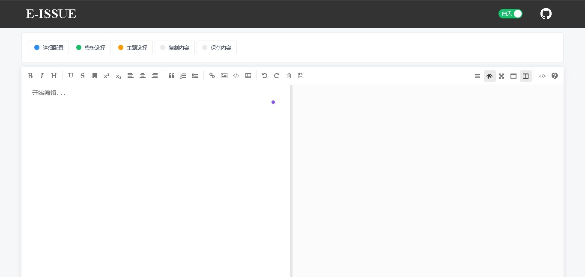
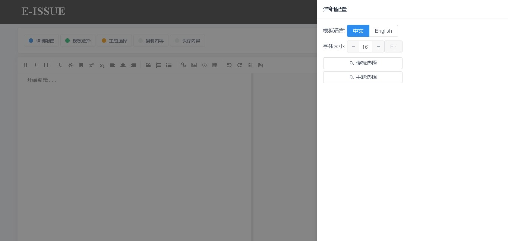
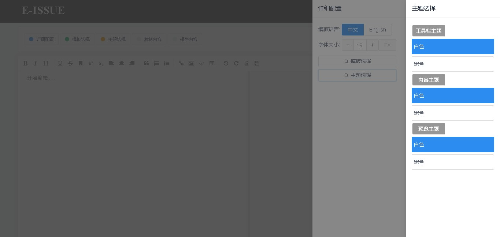

# 项目日志
## 事件
|日期|概略|细节|
|---|---|---|
|2023.09.24|初始化模板|TS+Vue3+Vite，下载依赖包|
|2023.09.25|实现布局|借助iView, FileSaver和Mavon-Editor实现完整布局，实现部分功能|
|2023.09.26|实现字体颜色更改|借助iView, FileSaver和Mavon-Editor实现完整布局，实现部分功能|

## 已实现的功能
- 已经实现的功能
- [x] 模板选择
- [x] 字体大小
- [x] 模板语言
- [x] 保存为文件
- [x] 复制内容
- [x] 全屏和预览(mavon库自带的)
- [x] 富文本编辑(mavon库自带的)
- [x] 粘贴图片(mavon库自带的)
- [x] 字体颜色

## 预计待实现的功能
- [ ] 主题配置
- [ ] 表情包选择和输入

## 效果图


## 过程
## 2023.09.24
1. `npm create vite@latest`创建项目
2. `选vue和ts`, 安装初始依赖
3. 优化TS报错问题`tsconfig.json`和`vite-env.d.ts`
```json
// 1.1 tsconfig.json
/* Bundler mode 修改*/
"moduleResolution": "node",
//原先是"moduleResolution": "bundler", 
// 使用vue3+ts需要更改为 "node"
// 不然会有以下报错：
// vue模块找不到，以及使用组合式API的时候报非类型化函数调用不能接受类型参数等错误

// 1.2 tsconfig.node.json
"moduleResolution": "node",　
// 也改为node

// 2. "allowImportingTsExtensions": true,
// 删除tsconfig文件中的"allowImportingTsExtensions": true,
```
```ts
// vite-env.d.ts
// 添加如下声明文件
declare module '*.vue' {
    import type { DefineComponent } from 'vue';
    const vueComponent: DefineComponent<{}, {}, any>;
    export default vueComponent;
}
```
4. 安装所需要的依赖包
> iview组件库, mavon-editor@3.0.1 markdown文档编辑库, FileSaver.js文件保存库。  
```sh
cnpm i view-ui-plus@1.3.1 mavon-editor@3.0.1 file-saver vue-router pinia --save
```
5. 去除掉其他不相干的文件。
6. 配置一下路由文件，仓库，引入和使用mavon-editor和view-ui-plus

### 配置路由文件
- 定义router对象
```ts
// router - index.ts
// 引入createRouter, 
// 引入createWebHistory
// 引入RouteRecordRaw (路由数组的泛型类型 routes: Array<RouteRecordRaw>)
import { createRouter, RouteRecordRaw, createWebHistory } from "vue-router";
import HelloWorld from '@/component/HelloWorld.vue'
const routes: Array<RouteRecordRaw> = [
    {
        path: '/',
        name: 'hello',
        component: HelloWorld
    },
    {
        path: '/home',
        name: 'home',
        component: () => import('@/pages/Home.vue')
    },
]
const router = createRouter({
    history: createWebHistory(),
    routes
})

export default router
```
- 导入
```ts
import { createApp } from 'vue'
import './style.css'
import App from './App.vue'
// import router from '@/router/index.ts'
import router from './router/index'
// 这里会报一个错：导入路径不能以“.ts”扩展名结束。
// 导入时，把.ts去掉， 改为相对路径
const app = createApp(App)
app.use(router).mount('#app')
```
- 修改一下vite.config.ts，使其能导入ts文件，并配置根路径
```ts
import { defineConfig } from 'vite'
import vue from '@vitejs/plugin-vue'
import path from 'path'
// 此时会报找不到模块path

// https://vitejs.dev/config/
export default defineConfig({
  plugins: [vue()],
  base: "/",
  //添加配置如下：
  resolve: {
    alias: { '@': path.resolve(__dirname, './src') }, //设置别名
    extensions: ['.mjs', '.js', '.ts', '.jsx', '.tsx', '.json']
  }
})
```
- 安装一下`types/node`包,
> 就可以愉快的使用node内置的`path`和`__dirname`了。
```sh
npm install @types/node --save-dev
```

### 配置store
- 定义store对象
```ts
// store -> count.ts
// 使用pinia的defineStore定义仓库
// 都带类型推断，基本不用定义或者引入类型
import { defineStore } from "pinia";
import { ref } from 'vue'
const useCount = defineStore('count', () => {
    const num = ref(0);
    return {
        num
    }
});

export default useCount;
```
- 引入pinia中的`{createPinia}`, 创建全局store.
```ts
// main.ts
import { createPinia } from 'pinia'
const pinia = createPinia();
app.use(router).use(pinia).mount('#app')
```
- 测试使用
> 在`Home.vue`中测试使用
```ts
import useCount from '../store/count';
const countStore = useCount();
console.log(countStore.num); //0
```
```html
<span>{{ countStore.num }}</span>
```

### 后续安排
> 配置FileSaver, mavon-editor和view-ui-plus


## 2023.09.25
### 配置FileSaver
```ts
// 组件内引入file-saver中的saver方法
import { saver } from 'file-saver'

// 1、 创建file文件(使用js的new File方法)
// 2、 保存file文件
let file = new File(
    ['hello'], 
    'hello world.txt',
    {
        type: "text/plain;charset=utf-8"
    }
)  // File(data, name, config)
saver(file); //保存并下载为文件。

```

### 配置mavon-editor(一个组件)
```ts
// 全局引入 模块和样式
// main.ts
import mavonEditor from 'mavon-editor'
import 'mavon-editor/dist/css/index.css'
app.use(mavonEditor)
```
- 测试使用
```html
<mavon-editor></mavon-editor>
```

### 配置view-ui-plus(组件库)
```ts
// 全局引入 组件库和样式
// 如果 import ViewUIPlus from 'view-ui-plus'会报错，报：模块没有默认导出。
// 改为别名的方式
import * as ViewUIPlus from 'view-ui-plus'
import 'view-ui-plus/dist/styles/viewuiplus.css'
app.use(ViewUIPlus)
```
- 测试一下组件
```html
<h1>测试一下iView按钮组件</h1>
<Space direction="vertical">
    <Space wrap>
        <Button>Default</Button>
        <Button type="primary">Primary</Button>
        <Button type="dashed">Dashed</Button>
        <Button type="text">Text</Button>
    </Space>
</Space>
```

### 开始布局页面
- 第1版页面
- 首页-Home



- 详细配置-Setting



- 单个配置-Setting



### 抽离组件和数据
> 1.布局组件和功能组件分开。  
> 2.使用store管理数据。
```js
/*
// Home.vue管理常规数据.
// store管理公共数据.(配置数据)
// localstorage管理持久化数据.(例如: 配置好以后的配置数据)
// 常规数据: 头部: 主题 , mavon的文本内容
*/
```
#### store数据
```ts
import { defineStore } from "pinia";
import { reactive } from 'vue'
const useIssue = defineStore('count', () => {
    // 所有配置
    const config = reactive({
        detail: {
            isShow: false,
            language: 'zh-CN', //语言
            fontSize: 16  //字体大小
        },
        tem: {
            isShow: false,
            value: '模板1' //模板
        },
        theme: {
            isShow: false,
            toolVal: '白色',  //工具栏主题
            contentVal: '白色', //内容主题
            previewVal: '白色' //预览主题
        }
    })

    // 全部模板
    const temList = reactive([
        {
            val: 'bugs',
            isTitle: true
        },
        {
            val: '模板1',
            isTitle: false
        },
        {
            val: '模板2',
            isTitle: false
        },
        {
            val: 'issue',
            isTitle: true
        },
        {
            val: '模板3',
            isTitle: false
        },
        {
            val: '模板4',
            isTitle: false
        }
    ])

    // 全部语言
    const langList = reactive(['zh-CN', 'en'])

    // 全部主题
    const themeList = reactive({
        toolThemeList: [
            {
                val: '工具栏主题',
                isTitle: true
            },
            {
                val: '黑色',
                isTitle: false
            },
            {
                val: '白色',
                isTitle: false
            }
        ],
        contentThemeList: [
            {
                val: '内容主题',
                isTitle: true
            },
            {
                val: '黑色',
                isTitle: false
            },
            {
                val: '白色',
                isTitle: false
            }
        ],
        previewThemeList: [
            {
                val: '预览主题',
                isTitle: true
            },
            {
                val: '黑色',
                isTitle: false
            },
            {
                val: '白色',
                isTitle: false
            }
        ]
    })
    return {
        config,
        temList,
        themeList,
        langList
    }
});

export default useIssue;
```

#### Home.vue
> 详细看源代码  
> 主要使用`props`,`emits`和`store`的配合   
> 以下主要放ts内容。
```ts
import EHeader from '../components/EHeader.vue';
import ETag from '../components/ETag.vue';
import EDrawerAll from '../components/EDrawerAll.vue';
import EDrawerTem from '../components/EDrawerTem.vue';
import EDrawerTheme from '../components/EDrawerTheme.vue';
// Home.vue管理常规数据.
// store管理公共数据.(配置数据)
// localstorage管理持久化数据.(例如: 配置好以后的配置数据)
// 常规数据: 头部: 主题 , mavon的文本内容
import { ref } from 'vue'
import useIssue from '../store/issue';
const { config } = useIssue();
console.log(config);

const theme = ref(false);  //false: 黑夜  true: 白天
const changeTheme = function (tag: boolean) {
    theme.value = tag;  //根据主题,决定整体样式
}
const mavonvalue = ref('');
```

#### 各个组件
> 详细看源代码  
> 主要使用`props`,`emits`和`store`的配合   
> 以下主要放ts内容。
#### EHeader.vue
```ts
import { defineProps, defineEmits } from 'vue';
defineProps<{ theme: boolean }>();
const emit = defineEmits(['changeTheme']);
const change = function (status: boolean) {
    emit('changeTheme', status);
}
```

#### ETag.vue
```ts
import useIssue from '../store/issue'
import { defineProps } from 'vue';
import { saveAs } from 'file-saver';

const props = defineProps<{
    mavonvalue: string
}>()

const { config } = useIssue();

const onCopy = function () {
    // 复制到剪贴板
    console.log(props.mavonvalue);
}

const onSave = async function () {
    const file = new File([props.mavonvalue], "mavon-issue.md", { type: "text/plain;charset=utf-8" });
    await saveAs(file);
    setTimeout(() => {
        alert('保存成功,请查看下载文件');
    }, 1000)
}
```
#### EDrawerAll.vue
```ts
import useIssue from '../store/issue'
const { config, langList } = useIssue();
```
#### EDrawerTem.vue
```ts
import useIssue from '../store/issue'
const { config, temList } = useIssue();
```
#### EDrawerTheme.vue
```ts
import useIssue from '../store/issue'
const { config, themeList } = useIssue();
```
### 配置
> 主要是配置好模板，与mavon库结合，实现功能。

